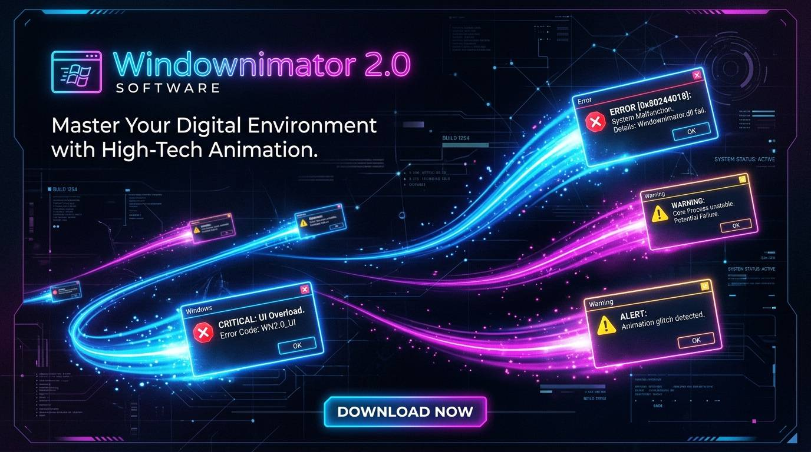
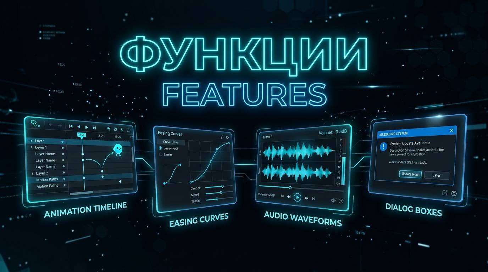

# 🎬 Windownimator 2.0



**Windownimator 2.0** — аниматор для Windows, позволяющий создавать анимационные ролики из настоящих системных окон Windows (`MessageBoxW`). 

Окна перемещаются по экрану по ключевым кадрам с использованием функций сглаживания (easing), воспроизводят звуки и экспортируются в автономные `.exe` файлы.

---



## 🌟 Основные возможности

- 🪟 **Нативные окна Windows:** Анимация строится на базе настоящих диалогов WinAPI (`MessageBoxW`, `SetWindowPos`).
- 🎨 **Интерфейс редактора:**
  - Интерактивный канвас виртуального экрана 1920x1080 с перетаскиванием окон мышкой.
  - Удобный таймлайн ключевых кадров.
  - График кривых движения (Easing Preview).
- 📈 **Плавные функции движения (Easing):**
  - Linear, Ease In, Ease Out, Ease In-Out, Bounce (пружина), Elastic (упругость).
- 🔊 **Звуковое сопровождение:**
  - Поддержка системных звуков Windows и пользовательских аудиофайлов (`.wav`, `.mp3`, `.ogg`).
  - Выбор конкретного кадра для запуска звука.
- 📦 **Экспорт в автономный `.exe`:**
  - Компиляция готовой анимации в независимый исполняемый файл Windows.
- 💾 **Формат проектов `.wa`:**
  - Сохранение и загрузка проектов в любой момент.

---

## 🛠 Технологический стек

- **Python 3.14+**
- **PySide6**
- **WinAPI (`ctypes`)**
- **PyInstaller**
- **Pygame / Winsound**

---

## 🚀 Запуск (.exe)

Скачайте готовый `Windownimator.exe` со страницы **[Releases](../../releases)** и запустите его.

### Сборка из исходников:

```bash
# Клонирование репозитория
git clone https://github.com/arsenjkin459g-source/windownimator.git
cd windownimator

# Установка зависимостей и сборка
pip install PySide6 pygame-ce pyinstaller
pyinstaller --onefile --noconsole --name=Windownimator main.py
```
