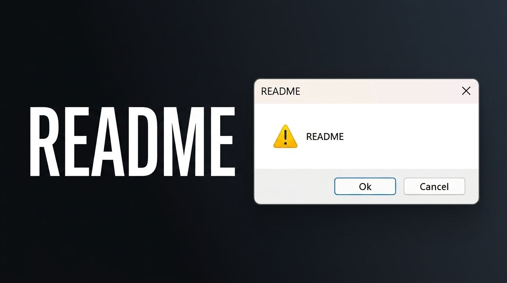

# Windownimator 2.0


Windownimator 2.0 — приложение для создания анимаций из системных окон Windows (`MessageBoxW`).

Окна перемещаются по экрану по ключевым кадрам с использованием функций сглаживания (easing), воспроизводят звуки и экспортируются в автономные `.exe` файлы.


- Анимация нативных диалоговых окон Windows через WinAPI (`MessageBoxW`, `SetWindowPos`).
- Графический редактор с виртуальным экраном 1920x1080 и таймлайном ключевых кадров.
- Поддержка функций сглаживания движения (Linear, Ease In/Out, Bounce, Elastic).
- Привязка системных и пользовательских звуков (`.wav`, `.mp3`, `.ogg`) к кадрам.
- Экспорт проектов в самостоятельные `.exe` файлы.
- Сохранение и загрузка проектов в формате `.wa`.

## Запуск (.exe)

Скачайте готовый `Windownimator.exe` со страницы Releases и запустите его.

### Сборка из исходного кода

```bash
git clone https://github.com/arsenjkin459g-source/windownimator.git
cd windownimator
pip install PySide6 pygame-ce pyinstaller
pyinstaller --onefile --noconsole --name=Windownimator main.py
```
